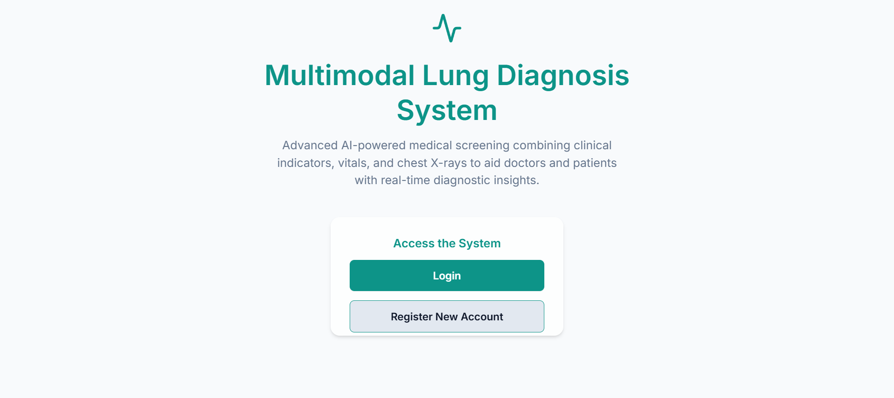
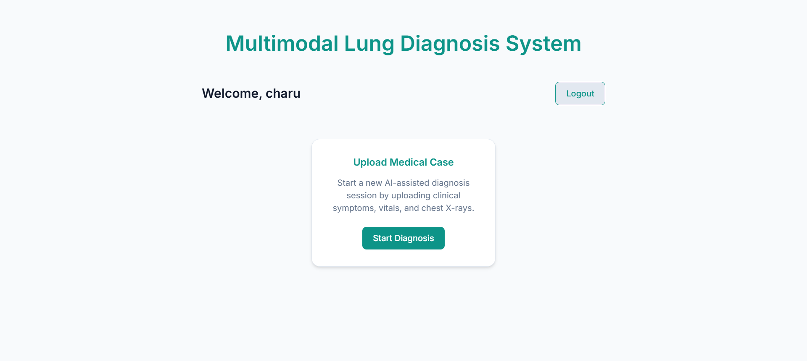
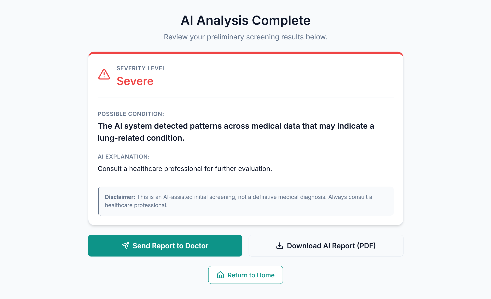
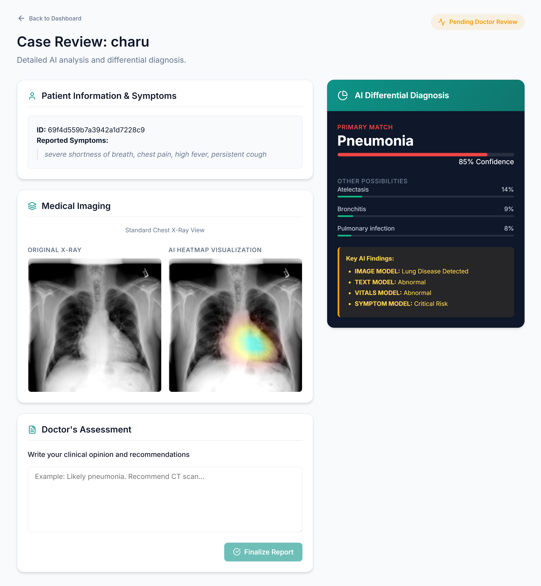
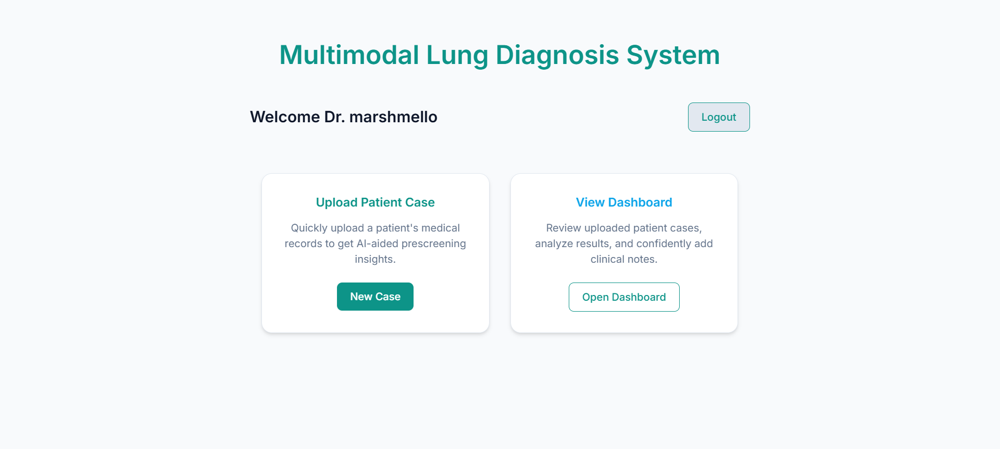

# 🩺 Multimodal Lung Diagnosis System

> A full-stack AI-powered clinical decision support platform that fuses chest X-rays, patient vitals, symptoms, and clinical text into a unified deep learning pipeline — with separate role-based interfaces for patients and doctors.

---

## 🔍 Problem It Solves

Most medical AI tools work on a single input — just an X-ray, or just symptoms. Real clinical diagnosis is multimodal: a doctor looks at imaging, reads lab reports, checks vitals, and listens to the patient at the same time.

This system replicates that reasoning:
- Patients submit symptoms, vitals, and chest X-rays through a self-service portal
- A 4-model fusion pipeline analyzes all inputs simultaneously
- Doctors receive AI-generated differential diagnoses with heatmap visualizations and confidence scores
- The doctor reviews, writes a clinical assessment, and finalizes the report

---

## 🖼️ Screenshots

### Landing Page


### Patient Dashboard — Start Diagnosis


### Patient Result — AI Analysis Complete


### Doctor Case Review — AI Differential Diagnosis + X-Ray Heatmap


### Doctor Dashboard — Manage Patient Cases


---

## ✨ Key Features

| Feature | Description |
|---|---|
| 🔐 Role-Based Auth | Separate login flows for Patient and Doctor roles (JWT) |
| 🖼️ X-Ray Upload | Patients upload chest X-rays; AI runs image classification |
| 🌡️ Vitals + Symptoms | Clinical indicators fed into separate ML models |
| 🧠 AI Heatmap | Grad-CAM style heatmap overlaid on X-ray showing disease-relevant regions |
| 📊 Differential Diagnosis | Primary diagnosis with confidence %, plus ranked alternative conditions |
| 👨‍⚕️ Doctor Review Panel | Doctor sees all patient data, AI findings, and writes clinical assessment |
| 📄 PDF Report Download | AI analysis report downloadable as PDF |
| 📨 Send to Doctor | Patient can forward AI report to selected doctor for review |

---

## 🏗️ System Architecture

```
Patient (Symptoms + Vitals + X-Ray)
              │
              ▼
     React + Vite Frontend
              │  JWT Auth  │  Axios API calls
              ▼
        FastAPI Backend
              │
    ┌─────────┴──────────────────────┐
    │     4-Model Fusion Pipeline     │
    ├─────────────────────────────────┤
    │  Model 1: Image CNN             │  ← Swin Transformer / ResNet on X-ray
    │  Model 2: Text Classifier       │  ← Sentence-BERT on clinical text
    │  Model 3: Symptom Severity      │  ← Sklearn on symptom features
    │  Model 4: Transformer Fusion    │  ← Cross-modal attention fusion
    └─────────┬───────────────────────┘
              │
              ▼
    Unified Prediction Output
    (Primary diagnosis + confidence + heatmap)
              │
              ▼
      Doctor Review Interface
```

---

## 📈 Model Performance

| Model | Metric | Score |
|---|---|---|
| Image Model (Swin Transformer) | ROC-AUC | **0.97** |
| Text Classification Model | Accuracy | **95%** |
| Multimodal Fusion Model | Multi-label classification | Trained on NIH + CheXpert datasets |
| Symptom Severity Model | Sklearn classifier | Sklearn 1.6.1 |

These results were validated on a 30-row clinically realistic evaluation dataset built from NIH ChestX-ray14 and CheXpert (via Kaggle).

---

## 🛠️ Tech Stack

| Layer | Technology |
|---|---|
| Frontend | React.js, Vite, CSS |
| Backend | Python, FastAPI, JWT Auth |
| ML — Image | PyTorch, Swin Transformer, ResNet |
| ML — Text | Sentence-BERT, Scikit-learn |
| ML — Fusion | PyTorch Transformer (cross-modal attention) |
| Evaluation | Custom `evaluate_fusion.py` pipeline |
| Data | NIH ChestX-ray14, CheXpert (Kaggle) |

---

## 👤 Two User Roles

### Patient Flow
1. Register → Login as Patient
2. Upload chest X-ray + enter symptoms and vitals
3. Receive AI analysis: severity level, possible condition, AI explanation
4. Download PDF report or send to a doctor for review

### Doctor Flow
1. Register → Login as Doctor
2. Dashboard shows all pending patient cases
3. Open a case: see patient symptoms, original X-ray, AI heatmap, differential diagnosis with confidence scores
4. Write clinical assessment and finalize the report

---

## ⚠️ Model Setup (Required Before Running)

Model files exceed GitHub's size limit and are hosted on Google Drive.

**Step 1** — Download from Google Drive:
👉 [Model Files — Google Drive](https://drive.google.com/drive/u/0/folders/1GI4wy4oP_a75VNr-hlvSHxZGiHVdOQqr)

**Step 2** — Place inside `backend/models/`:
```
backend/models/
├── ImageModelBothDatasets.pth              # ~347 MB — Swin Transformer image model
├── final_transformer_model.pth             # ~28.5 MB — Fusion model
├── symptom_severity_model_sklearn161.joblib
├── symptom_severity_model_metadata_sklearn161.joblib
└── text_model.joblib
```

---

## ⚙️ Local Setup

### Prerequisites
- Python 3.9+
- Node.js 16+
- Downloaded model files (see above)

### Backend
```bash
cd backend
python -m venv venv

# Windows
venv\Scripts\activate
# macOS/Linux
source venv/bin/activate

pip install -r requirements.txt
uvicorn main:app --reload
```
Backend: `http://127.0.0.1:8000`

### Frontend
```bash
cd frontend
npm install
npm run dev
```
Frontend: `http://localhost:5173`

---

## 📊 Running the Evaluation Pipeline

```bash
# Activate virtual environment first
python evaluate_fusion.py
```

Runs inference across all 4 modalities on the 30-row evaluation dataset and reports fusion accuracy metrics.

---

## 💡 What Makes This Technically Significant

- **Multimodal fusion** — not just image classification; fuses 4 heterogeneous data types using cross-modal attention
- **Dual-dataset image model** — trained on both NIH ChestX-ray14 and CheXpert for better generalization across imaging conditions
- **Grad-CAM heatmap** — visually explains which lung regions drove the AI's prediction, making the system interpretable for doctors
- **Role-based clinical workflow** — patient and doctor interfaces are fully separated with JWT authentication, mirroring real hospital system architecture
- **Evaluated on realistic data** — 30-row test dataset built from actual NIH/CheXpert cases with binary ground-truth labels

---

## 📁 Project Structure

```
Multimodal-Lung-Diagnosis-System/
├── backend/
│   ├── ml/                    # Model inference logic
│   ├── models/                # Trained model files (git-ignored)
│   ├── routers/               # FastAPI route handlers
│   └── main.py
├── frontend/
│   └── src/
│       ├── pages/             # Patient and Doctor page components
│       ├── components/        # Shared UI components
│       └── api/               # Axios API layer
├── evaluate_fusion.py         # Evaluation pipeline
├── fusion_evaluation_dataset.csv
└── fusion_results.csv
```

